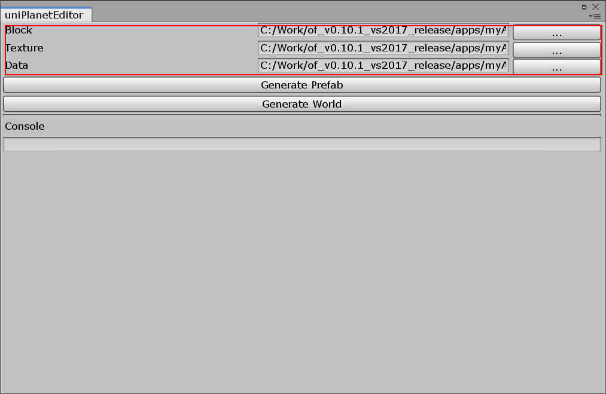
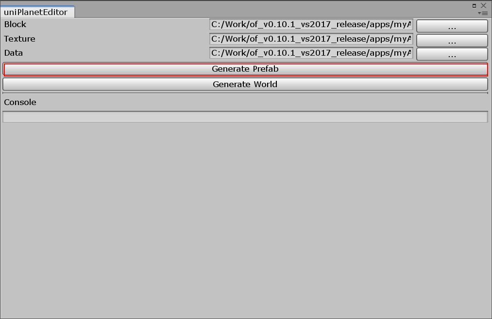
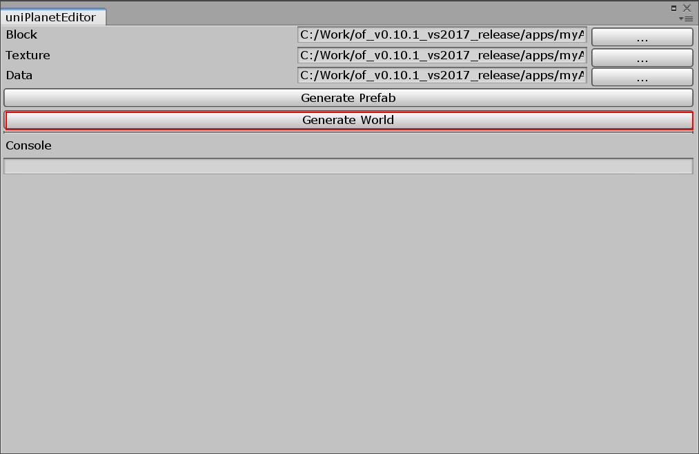

# uniPlanet
[ofPlanet](https://github.com/desktopgame/ofPlanet)によって生成されたJSONをUnityのプレーンに変換します。

## how to use
blocks.json textures.json と、エクスポートによって得られたjsonファイルを入力する。

`Generate Prefab`ボタンを押す。  
すると `Assets/uniPlanetData`フォルダ が生成される。
この中にはテクスチャの一覧とプレーン/ブロック化されたプレハブが含まれます。

`Generate World`ボタンを押す
これで現在のヒエラルキービューでブロックが生成されます。

